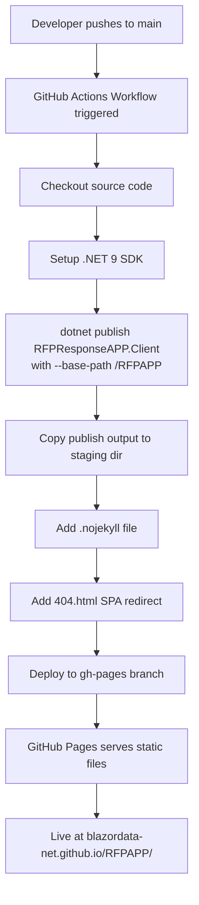
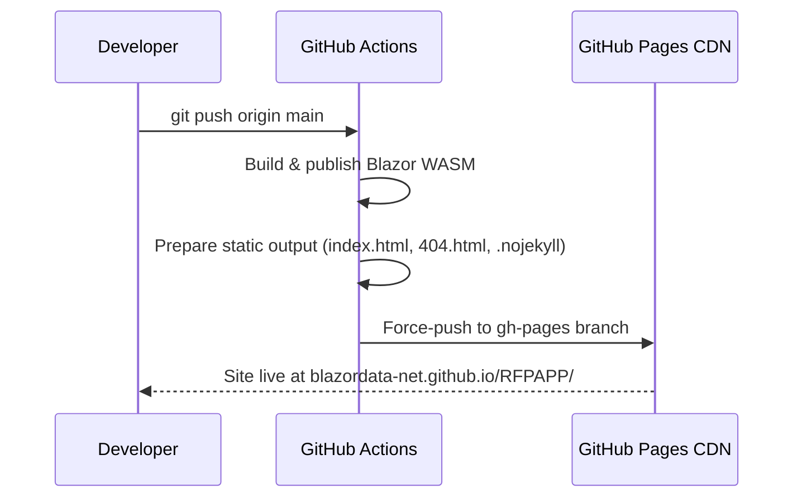

# GitHub Pages Deployment Plan

## Overview

This document describes the plan for automatically building the **RFP Response Creator** Blazor WebAssembly application and deploying a live demo to GitHub Pages whenever changes are pushed to the `main` branch.

The deployed demo will be publicly accessible at:

```
https://blazordata-net.github.io/RFPAPP/
```

A link to this page will be added to the repository's `README.md` for easy discovery.

---

## Architecture

The repository contains two relevant projects for this deployment:

| Project | SDK | Role |
|---|---|---|
| `RFPResponsePOC/RFPResponsePOC.Client` | `Microsoft.NET.Sdk.BlazorWebAssembly` | Client-side Blazor WASM app — the static artifact that can be hosted on GitHub Pages |
| `RFPResponsePOC/RFPResponsePOC` | `Microsoft.NET.Sdk.Web` | ASP.NET Core host — **not** deployed to Pages (requires a server) |

Only the **client** project is deployed to Pages, because GitHub Pages only hosts static files.



---

## Key Considerations

### Base Path

Because GitHub Pages serves the app under a sub-path (`/RFPAPP/`), the Blazor app must be published with a matching base path. This is done by passing `--base-path /RFPAPP` to `dotnet publish`, which sets the `<base href>` in `index.html` automatically.

### SPA Client-Side Routing

GitHub Pages does not understand Blazor's client-side routing. If a user navigates directly to a deep link (e.g., `/RFPAPP/counter`), GitHub Pages returns a 404. The standard workaround is:

1. Place a `404.html` in the root that contains JavaScript to redirect back to `index.html`, preserving the intended path in the query string.
2. Place a snippet in `index.html` to read the redirect path from the query string and restore `history.pushState`.

This is the same technique used by [spa-github-pages](https://github.com/rafgraph/spa-github-pages).

### `.nojekyll` File

GitHub Pages runs Jekyll processing by default, which ignores files and folders prefixed with `_` (such as Blazor's `_framework/` directory). Adding a `.nojekyll` file at the repository root of the `gh-pages` branch disables Jekyll and ensures all assets are served correctly.

---

## Workflow Design

```mermaid
flowchart LR
    subgraph Trigger
        T1[push to main]
        T2[workflow_dispatch]
    end

    subgraph Build Job
        B1[actions/checkout@v4]
        B2[actions/setup-dotnet@v4 .NET 9]
        B3[dotnet publish --configuration Release --base-path /RFPAPP]
        B4[Copy wwwroot output to ./release]
        B5[Touch .nojekyll]
        B6[Copy 404.html]
    end

    subgraph Deploy Job
        D1[peaceiris/actions-gh-pages@v4<br/>publish_dir: ./release<br/>branch: gh-pages]
    end

    T1 --> B1
    T2 --> B1
    B1 --> B2 --> B3 --> B4 --> B5 --> B6 --> D1
```

---

## File Changes Required

### 1. New Workflow: `.github/workflows/deploy-ghpages.yml`

A new GitHub Actions workflow file that:

- Triggers on every push to `main` and supports manual dispatch.
- Builds the Blazor WASM client with the correct base path.
- Patches `index.html` for SPA routing support.
- Deploys the static output to the `gh-pages` branch using `peaceiris/actions-gh-pages`.

```yaml
name: Deploy to GitHub Pages

on:
  push:
    branches:
      - main
  workflow_dispatch:

permissions:
  contents: write

jobs:
  deploy:
    runs-on: ubuntu-latest

    steps:
      - name: Checkout
        uses: actions/checkout@v4

      - name: Setup .NET
        uses: actions/setup-dotnet@v4
        with:
          dotnet-version: '9.x'

      - name: Publish Blazor WASM client
        run: |
          dotnet publish RFPResponsePOC/RFPResponsePOC.Client/RFPResponseAPP.Client.csproj \
            --configuration Release \
            --output ./release-output

      - name: Prepare gh-pages directory
        run: |
          mkdir -p ./release
          cp -r ./release-output/wwwroot/. ./release/

          # Disable Jekyll so _framework assets are served
          touch ./release/.nojekyll

          # Fix index.html base href for GitHub Pages sub-path
          sed -i 's|<base href="/" />|<base href="/RFPAPP/" />|g' ./release/index.html

          # Add 404.html for SPA client-side routing fallback
          cp ./release/index.html ./release/404.html

      - name: Deploy to GitHub Pages
        uses: peaceiris/actions-gh-pages@v4
        with:
          github_token: ${{ secrets.GITHUB_TOKEN }}
          publish_dir: ./release
          publish_branch: gh-pages
```

> **Note:** The `--base-path` flag was introduced in .NET 8. If `dotnet publish` does not automatically rewrite the `<base href>`, the `sed` step ensures the tag is patched correctly.

### 2. Update `README.md`

Add a GitHub Pages badge and live-demo link near the top of `README.md`, next to the existing badges:

```markdown
[](https://blazordata-net.github.io/RFPAPP/)
```

And a dedicated section:

```markdown
### 🌐 Live Demo (GitHub Pages)
[https://blazordata-net.github.io/RFPAPP/](https://blazordata-net.github.io/RFPAPP/)
```

---

## GitHub Repository Settings

After the first workflow run creates the `gh-pages` branch, the following setting must be configured once in the GitHub UI (or via the API):

1. Go to **Settings → Pages**.
2. Under **Source**, select **Deploy from a branch**.
3. Choose branch: `gh-pages`, folder: `/ (root)`.
4. Save.

GitHub will then serve the contents of the `gh-pages` branch at `https://blazordata-net.github.io/RFPAPP/`.



---

## SPA Routing: 404.html Redirect Pattern

The `404.html` file uses a small JavaScript snippet to redirect the browser back to `index.html` while preserving the original path:

```html
<!DOCTYPE html>
<html>
  <head>
    <meta charset="utf-8" />
    <title>RFP Response Creator</title>
    <script>
      // GitHub Pages SPA redirect
      // Stores the current path in sessionStorage and redirects to /
      var pathSegmentsToKeep = 1; // number of path segments in the base path (/RFPAPP)
      var l = window.location;
      l.replace(
        l.protocol + '//' + l.hostname + (l.port ? ':' + l.port : '') +
        l.pathname.split('/').slice(0, 1 + pathSegmentsToKeep).join('/') + '/?/' +
        l.pathname.slice(1).split('/').slice(pathSegmentsToKeep).join('/').replace(/&/g, '~and~') +
        (l.search ? '&' + l.search.slice(1).replace(/&/g, '~and~') : '') +
        l.hash
      );
    </script>
  </head>
  <body></body>
</html>
```

And in `index.html`, before `</body>`:

```html
<script>
  // GitHub Pages SPA redirect handler
  (function(l) {
    if (l.search[1] === '/') {
      var decoded = l.search.slice(1).split('&').map(function(s) {
        return s.replace(/~and~/g, '&');
      }).join('?');
      window.history.replaceState(null, null,
        l.pathname.slice(0, -1) + decoded + l.hash
      );
    }
  }(window.location));
</script>
```

---

## Summary Checklist

- [x] Understand project structure (Blazor WASM client + ASP.NET Core host)
- [ ] Create `.github/workflows/deploy-ghpages.yml`
- [ ] Verify `.nojekyll`, `404.html`, and base-href rewriting in workflow
- [ ] Update `README.md` with GitHub Pages badge and link
- [ ] Enable GitHub Pages in repository **Settings → Pages** (branch: `gh-pages`)
- [ ] Confirm live URL: `https://blazordata-net.github.io/RFPAPP/`
