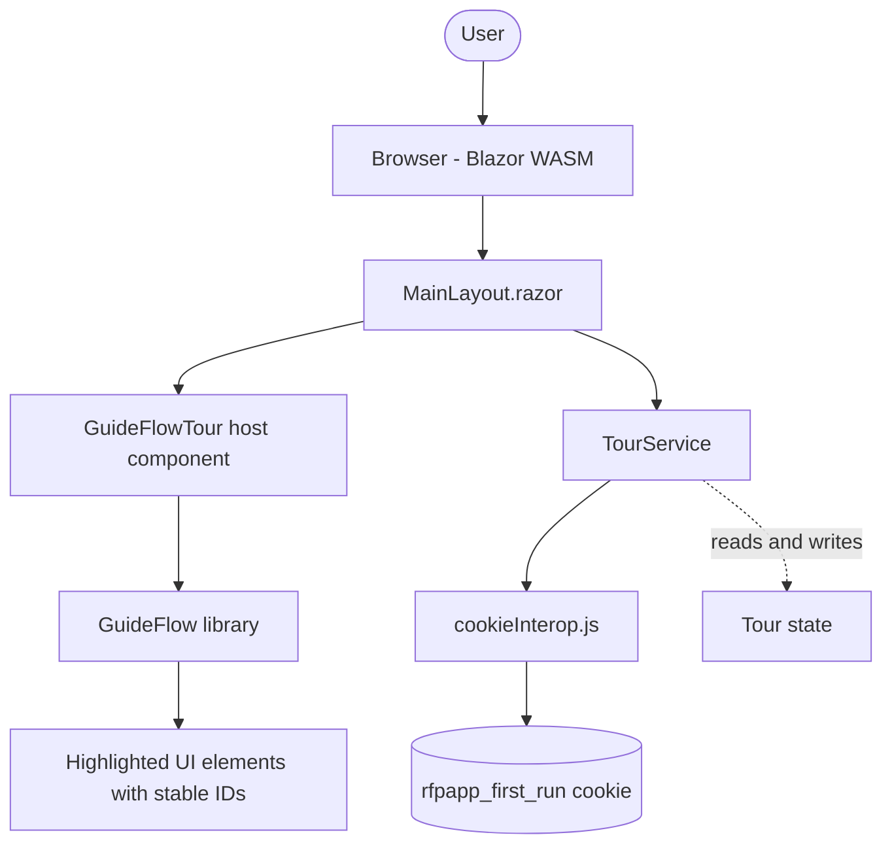
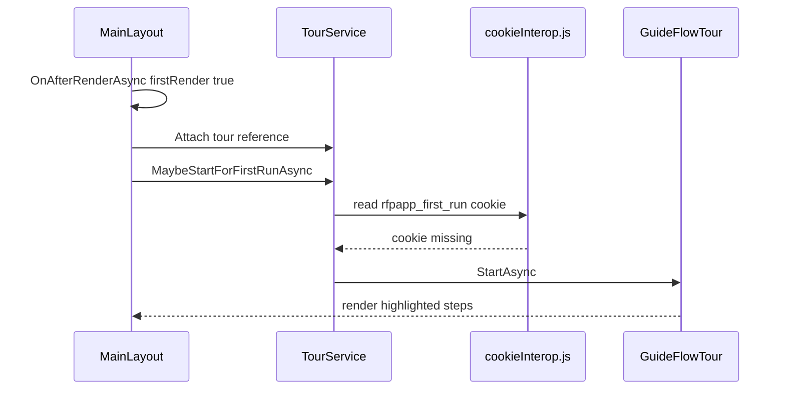
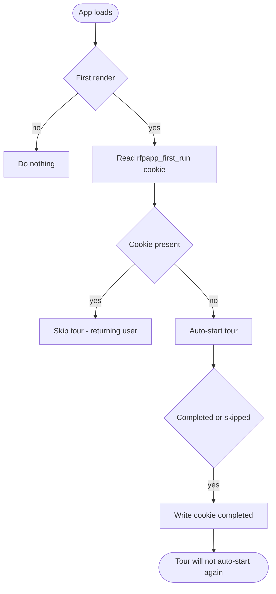
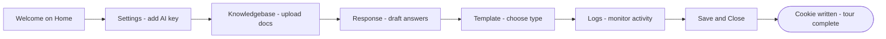
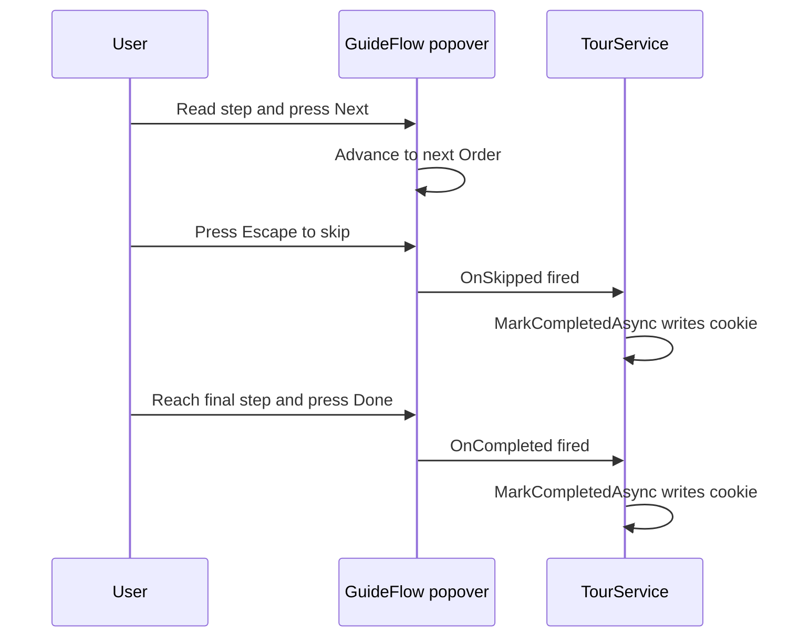
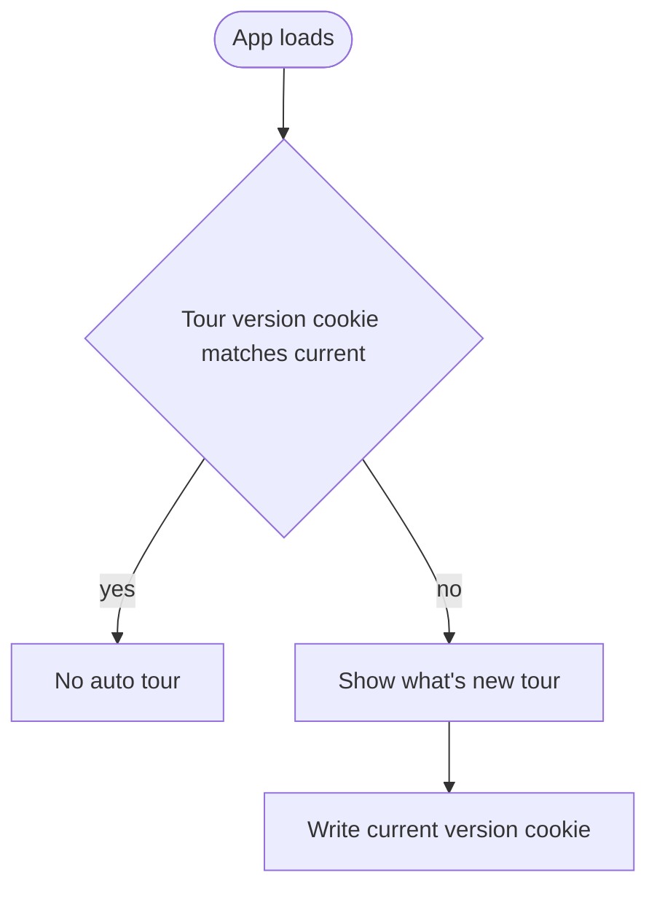

# GuideFlow Animated Tour — Implementation Plan for RFPAPP

This document is a developer-ready implementation plan for adding the
[GuideFlow](https://miraclefoundation.github.io/GuideFlow/docs/animated-tour) animated
guided tour to the [RFPAPP](https://github.com/BlazorData-Net/RFPAPP) application
(the **RFP Response Creator**, a Blazor WebAssembly app targeting .NET 10).

It covers three features:

1. **Feature #1** — Integrate the GuideFlow animated tour library into RFPAPP.
2. **Feature #2** — Cookie-based first-run detection so the tour only auto-plays on a user's very first visit.
3. **Feature #3** — Author a step-by-step tour that walks the user through every major feature of RFPAPP.

---

## 1. Goals and Scope

| Goal | Description |
| --- | --- |
| Onboard new users | Automatically show a guided walkthrough the first time the app is opened. |
| Non-intrusive | Returning users never see the tour automatically; it can be replayed on demand. |
| Cover all features | The tour visits Home, Knowledgebase, Response, Logs, and Settings, plus key in-page controls. |
| Maintainable | Tour steps live in one place and are easy to extend as the app grows. |
| Accessible | Keyboard navigation and screen-reader support are preserved (GuideFlow provides ARIA out of the box). |

### Non-goals

- Replacing existing in-app help text or documentation.
- Per-feature contextual tours (a single end-to-end tour is the initial deliverable).
- Server-side persistence of tour completion (state is stored client-side only).

---

## 2. Background: How GuideFlow Works

GuideFlow is a zero-JS-dependency Blazor component library inspired by Driver.js. Key facts
relevant to this plan:

- **Install:** `dotnet add package GuideFlow`
- **Registration:** `builder.Services.AddGuideFlow();` in `Program.cs`
- **Markup:** a `<GuideFlowTour>` component wraps a set of `<GuideFlowStep>` children.
- **Targeting:** each step uses a CSS `Selector` (for example `#menu-knowledgebase`) to highlight an element.
- **Control:** the tour is started programmatically via `await tour.StartAsync();`.
- **Persistence:** GuideFlow has optional `localStorage` state persistence, but for first-run
  detection this plan uses an explicit cookie (see Feature #2) so the trigger is centralized and predictable.

### Core API surface used by this plan

| Element | Purpose | Key parameters |
| --- | --- | --- |
| `GuideFlowTour` | Container that drives the tour | `@ref`, `TourOptions`, `OnCompleted`, `OnSkipped` |
| `GuideFlowStep` | One highlighted step | `Selector`, `Title`, `Order`, `Placement` |
| `TourOptions` | Behavior/appearance config | `Overlay`, `ShowProgress`, theme settings |
| `Placement` enum | Popover position | `Top`, `Bottom`, `Left`, `Right` |

> Note: confirm exact parameter names and event names against the installed package version,
> since the library is actively developed. Treat the table above as the expected contract.

---

## 3. High-Level Architecture

The tour is a cross-cutting concern. It is hosted once in `MainLayout` so it is available on
every page, and it is driven by a small `TourService` that owns first-run detection and the
start/replay logic.



### Component responsibilities

| Component | Responsibility |
| --- | --- |
| `MainLayout.razor` | Hosts the `GuideFlowTour`, exposes a Help/Replay button, calls `TourService` on first render. |
| `TourService` | Decides whether to auto-start, starts/replays the tour, persists completion. |
| `cookieInterop.js` | Thin JS interop for reading/writing/deleting the first-run cookie. |
| `TourSteps` (markup/partial) | Declares the ordered list of `GuideFlowStep` items. |
| Target pages/components | Provide stable `id` attributes that step selectors point at. |

---

## 4. Feature #1 — Integrate GuideFlow

### 4.1 Add the package

In the client project [RFPResponsePOC/RFPResponsePOC.Client/RFPResponseAPP.Client.csproj](../RFPResponsePOC/RFPResponsePOC.Client/RFPResponseAPP.Client.csproj):

```xml
<ItemGroup>
  <PackageReference Include="GuideFlow" Version="1.*" />
</ItemGroup>
```

> Do not change the project's SDK/target framework version. Add only the package reference.

### 4.2 Register the service

In [RFPResponsePOC/RFPResponsePOC.Client/Program.cs](../RFPResponsePOC/RFPResponsePOC.Client/Program.cs):

```csharp
builder.Services.AddGuideFlow();
builder.Services.AddScoped<TourService>();
```

### 4.3 Add usings

In [RFPResponsePOC/RFPResponsePOC.Client/_Imports.razor](../RFPResponsePOC/RFPResponsePOC.Client/_Imports.razor):

```razor
@using GuideFlow.Components
@using GuideFlow.Enums
@using GuideFlow.Models
```

### 4.4 Host the tour in MainLayout

Add the tour host and a Help button to
[RFPResponsePOC/RFPResponsePOC.Client/Layout/MainLayout.razor](../RFPResponsePOC/RFPResponsePOC.Client/Layout/MainLayout.razor).
The existing layout already injects `IJSRuntime` and `ILocalStorageService` and already uses
`OnAfterRenderAsync(firstRender)`, which is the natural hook for the first-run check.

```razor
@inject TourService Tour

<!-- Help / Replay button in the existing top-row action area -->
<RadzenButton Icon="help_outline" Size="ButtonSize.ExtraSmall"
              Click="@(() => Tour.ReplayAsync())" Text="Tour" />

<!-- Tour host: rendered once, available on every page -->
<GuideFlowTour @ref="tour" TourOptions="tourOptions"
               OnCompleted="OnTourFinished" OnSkipped="OnTourFinished">
    <TourSteps />
</GuideFlowTour>

@code {
    private GuideFlowTour tour;
    private readonly TourOptions tourOptions = new()
    {
        Overlay = true,
        ShowProgress = true
    };

    protected override async Task OnAfterRenderAsync(bool firstRender)
    {
        if (firstRender)
        {
            // ...existing version-check logic stays here...
            Tour.Attach(tour);
            await Tour.MaybeStartForFirstRunAsync();
        }
    }

    private async Task OnTourFinished() => await Tour.MarkCompletedAsync();
}
```

### 4.5 Integration sequence



---

## 5. Feature #2 — Cookie-Based First-Run Detection

### 5.1 Why a cookie

The requirement is explicit: use a **cookie** to detect first-time use. Blazor WASM cannot set
cookies from C# directly in a convenient way, so a tiny JS interop module handles cookie I/O.
The cookie is the single source of truth for "has this browser seen the tour".

> A `localStorage` flag (via the already-referenced `Blazored.LocalStorage`) is a valid
> alternative, but this plan follows the stated requirement and uses a cookie. The same
> `TourService` API works regardless of the backing store, so swapping is low-cost.

### 5.2 Cookie definition

| Property | Value |
| --- | --- |
| Name | `rfpapp_first_run` |
| Value | `completed` (set after the tour finishes or is skipped) |
| Expiry | 365 days (effectively "permanent" for onboarding) |
| Path | `/` |
| SameSite | `Lax` |
| Secure | `true` when served over HTTPS |

Logic: if the cookie is **absent**, this is a first run and the tour auto-starts. When the
tour completes or is skipped, the cookie is written so it never auto-starts again.

### 5.3 JS interop module

Create `wwwroot/js/cookieInterop.js` in the client project:

```javascript
export function getCookie(name) {
    const match = document.cookie.match(new RegExp('(^| )' + name + '=([^;]+)'));
    return match ? decodeURIComponent(match[2]) : null;
}

export function setCookie(name, value, days) {
    const expires = new Date(Date.now() + days * 864e5).toUTCString();
    const secure = location.protocol === 'https:' ? '; Secure' : '';
    document.cookie =
        name + '=' + encodeURIComponent(value) +
        '; expires=' + expires + '; path=/; SameSite=Lax' + secure;
}

export function deleteCookie(name) {
    document.cookie = name + '=; expires=Thu, 01 Jan 1970 00:00:00 GMT; path=/';
}
```

Reference it from the host page so it is available (or import on demand from `TourService`).

### 5.4 TourService

Create `Services/TourService.cs` in the client project:

```csharp
public class TourService
{
    private const string CookieName = "rfpapp_first_run";
    private const int CookieDays = 365;

    private readonly IJSRuntime _js;
    private IJSObjectReference _module;
    private GuideFlowTour _tour;

    public TourService(IJSRuntime js) => _js = js;

    public void Attach(GuideFlowTour tour) => _tour = tour;

    private async Task<IJSObjectReference> ModuleAsync() =>
        _module ??= await _js.InvokeAsync<IJSObjectReference>(
            "import", "./js/cookieInterop.js");

    public async Task MaybeStartForFirstRunAsync()
    {
        var module = await ModuleAsync();
        var seen = await module.InvokeAsync<string>("getCookie", CookieName);
        if (string.IsNullOrEmpty(seen) && _tour is not null)
        {
            await _tour.StartAsync();
        }
    }

    public async Task ReplayAsync()
    {
        if (_tour is not null)
        {
            await _tour.StartAsync(); // manual replay, ignores cookie
        }
    }

    public async Task MarkCompletedAsync()
    {
        var module = await ModuleAsync();
        await module.InvokeVoidAsync("setCookie", CookieName, "completed", CookieDays);
    }
}
```

### 5.5 First-run decision flow



### 5.6 Edge cases

| Case | Behavior |
| --- | --- |
| Cookies disabled in browser | Tour may auto-start every visit; acceptable degradation. Optionally fall back to `localStorage`. |
| User clears cookies | Treated as a new first run; tour plays again. |
| User skips midway | Cookie is written on skip, so it does not nag on the next visit. |
| Manual replay | `ReplayAsync()` always plays and does **not** depend on or change the cookie. |
| Private/incognito session | Cookie does not persist; tour replays in a fresh session. |

---

## 6. Feature #3 — Author the Step-by-Step Tour

### 6.1 Target the navigation and key controls

RFPAPP's primary navigation is a `RadzenMenu` rendered in
[RFPResponsePOC/RFPResponsePOC.Client/Pages/Home.razor](../RFPResponsePOC/RFPResponsePOC.Client/Pages/Home.razor)
with items for **Home, Knowledgebase, Response, Logs, Settings**. To target these reliably,
add stable `id` attributes (selectors must be deterministic and not depend on Radzen-generated IDs).

Suggested IDs to add:

| UI element | Suggested id | Page/component |
| --- | --- | --- |
| Home menu item | `menu-home` | Home.razor |
| Knowledgebase menu item | `menu-knowledgebase` | Home.razor |
| Response menu item | `menu-response` | Home.razor |
| Logs menu item | `menu-logs` | Home.razor |
| Settings menu item | `menu-settings` | Home.razor |
| Primary call-to-action button | `home-cta` | Home.razor |
| Save and Close button | `btn-save-close` | MainLayout.razor |
| Knowledgebase upload area | `kb-upload` | Knowledgebase.razor |
| Response template picker | `response-template` | Response.razor |
| Settings AI key field | `settings-aikey` | Settings.razor |

Example (Radzen supports passing through HTML attributes via `@attributes` or a wrapping element):

```razor
<RadzenMenuItem Click="OnKnowledgebaseClicked" Text="Knowledgebase"
                Icon="library_books" id="menu-knowledgebase" />
```

> Verify that Radzen renders the `id` onto a queryable DOM element. If it does not, wrap the
> menu item (or target element) in a `<span id="...">` that GuideFlow can select.

### 6.2 The TourSteps component

Create `Components/TourSteps.razor` (or inline in `MainLayout`). Steps are ordered with `Order`
and positioned with `Placement`.

```razor
<GuideFlowStep Selector="#menu-home" Title="Welcome to RFP Response Creator"
               Order="0" Placement="Placement.Bottom">
    <p>This quick tour shows how to turn an RFP into a polished, AI-generated proposal.</p>
</GuideFlowStep>

<GuideFlowStep Selector="#settings-aikey" Title="Step One - Add your AI key"
               Order="1" Placement="Placement.Right">
    <p>Open Settings and paste your AI key. Nothing works until a valid key is saved.</p>
</GuideFlowStep>

<GuideFlowStep Selector="#menu-knowledgebase" Title="Build your Knowledgebase"
               Order="2" Placement="Placement.Bottom">
    <p>Upload past proposals and reference documents. The app indexes them for answers.</p>
</GuideFlowStep>

<GuideFlowStep Selector="#menu-response" Title="Create a Response"
               Order="3" Placement="Placement.Bottom">
    <p>Pick a template, upload the RFP, and let AI draft answers you can review and edit.</p>
</GuideFlowStep>

<GuideFlowStep Selector="#response-template" Title="Choose a template"
               Order="4" Placement="Placement.Right">
    <p>General RFPs or Venue RFPs - templates shape the structure of the final document.</p>
</GuideFlowStep>

<GuideFlowStep Selector="#menu-logs" Title="Review the Logs"
               Order="5" Placement="Placement.Bottom">
    <p>Track processing activity and troubleshoot any issues here.</p>
</GuideFlowStep>

<GuideFlowStep Selector="#btn-save-close" Title="Save your work"
               Order="6" Placement="Placement.Left">
    <p>Save and Close packages your data so you can pick up where you left off.</p>
</GuideFlowStep>
```

> Edge and step labels deliberately avoid starting with a number followed by a period
> (for example "Step One" instead of "1.") so popover and diagram renderers do not treat them
> as numbered lists.

### 6.3 Cross-page tours

Some steps target elements that live on different pages (for example the AI key field on
**Settings** or the upload area on **Knowledgebase**). There are two viable strategies:

| Strategy | Description | Trade-off |
| --- | --- | --- |
| **A. Navigation-aware steps** | The tour navigates between pages between steps using `NavigationManager`, then resumes. | Most thorough; requires hooking step transitions to route changes. |
| **B. Menu-focused tour** | The tour highlights the **menu items** that open each feature and explains what each does, without leaving the current page. | Simplest and most robust; recommended for v1. |

**Recommendation:** ship **Strategy B** first (highlight the menu items and the on-page CTA),
then iterate toward **Strategy A** for a deep, page-by-page walkthrough once the menu IDs and
GuideFlow behavior are proven.

### 6.4 Tour content flow (Strategy B)



### 6.5 User interaction during a step



---

## 7. Implementation Checklist

| # | Task | File(s) |
| --- | --- | --- |
| 1 | Add `GuideFlow` package reference | RFPResponseAPP.Client.csproj |
| 2 | Register `AddGuideFlow()` and `TourService` | Program.cs |
| 3 | Add GuideFlow usings | _Imports.razor |
| 4 | Create `cookieInterop.js` | wwwroot/js/cookieInterop.js |
| 5 | Create `TourService` | Services/TourService.cs |
| 6 | Host `GuideFlowTour` + Help button in layout | Layout/MainLayout.razor |
| 7 | Wire first-run check in `OnAfterRenderAsync` | Layout/MainLayout.razor |
| 8 | Add stable `id`s to menu items and key controls | Home.razor, Settings.razor, Knowledgebase.razor, Response.razor |
| 9 | Author `TourSteps.razor` | Components/TourSteps.razor |
| 10 | Wire `OnCompleted`/`OnSkipped` to write the cookie | Layout/MainLayout.razor |

---

## 8. Testing and Validation

### 8.1 Manual test matrix

| Scenario | Expected result |
| --- | --- |
| Fresh browser, no cookie | Tour auto-starts on first load. |
| Complete the tour | Cookie `rfpapp_first_run=completed` is set; reload does not auto-start. |
| Skip the tour midway | Cookie is set; reload does not auto-start. |
| Click the Help/Tour button | Tour replays regardless of cookie state. |
| Delete the cookie and reload | Tour auto-starts again. |
| Keyboard only (Tab, arrows, Esc, Enter) | Navigation works; focus stays trapped in the popover. |
| Screen reader | Step titles and content are announced (ARIA roles present). |
| Each step's selector | Highlights the correct element; popover positioned per `Placement`. |

### 8.2 Automated checks

- Unit-test `TourService` decision logic by mocking the JS module (cookie present vs absent).
- Add a smoke test that each declared `Selector` resolves to a rendered element (can be a
  Playwright check that the element with the expected `id` exists on the relevant page).

### 8.3 Regression watch points

- Confirm Radzen actually emits the `id` you set; otherwise wrap with a plain element.
- Confirm GuideFlow's overlay does not block the existing Save-and-Close flow.
- Confirm the tour host does not interfere with `InteractiveWebAssemblyRenderMode(prerender: false)`.

---

## 9. Rollout and Future Enhancements

| Phase | Deliverable |
| --- | --- |
| Phase 1 | Strategy B menu-focused tour + cookie first-run gating. |
| Phase 2 | Strategy A navigation-aware, page-by-page deep tour. |
| Phase 3 | Versioned tours: bump the cookie name (for example `rfpapp_first_run_v2`) when major features ship so existing users see a "what's new" tour. |
| Phase 4 | Per-page contextual "?" buttons that launch a focused mini-tour for that page only. |

### Versioned re-onboarding idea



---

## 10. References

- GuideFlow animated tour docs: https://miraclefoundation.github.io/GuideFlow/docs/animated-tour
- GuideFlow API reference: https://miraclefoundation.github.io/GuideFlow/docs/api
- GuideFlow repository: https://github.com/MiracleFoundation/GuideFlow
- RFPAPP repository: https://github.com/BlazorData-Net/RFPAPP
